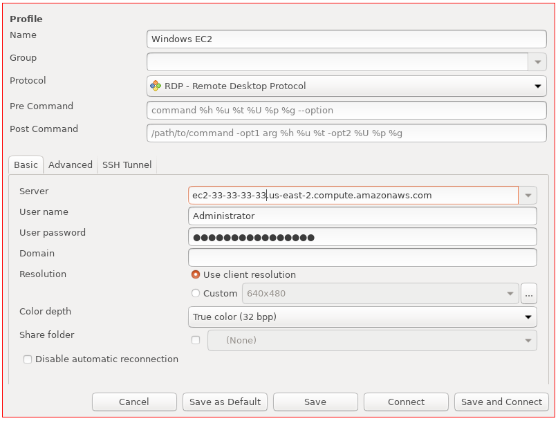
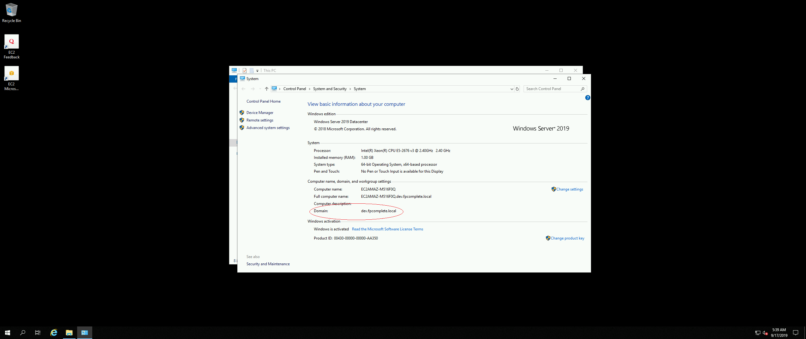

# Active Directory with seamless Windows EC2 join (from ASG in different VPC)

We have two different VPC's here:

* A VPC named `vpc-1` which has Active Directory (AD) deployed in it.
* Another VPC named `vpc-2` which has ASG in it. The EC2 instance in
  it will try to join the AD.

The goal is to do VPC peering between them, add appropriate routes and
then join the EC2 instances in `vpc-2` (from the ASG) to the AD in
`vpc-1`

The terraform code is built on top of
[vpc-scenario1](https://docs.aws.amazon.com/vpc/latest/userguide/VPC_Scenario1.html)
with two additional resources.

## Environment creation and deployment

To use this example set up AWS credentials and then run the commands in the 
following order:

```
make ssh-key
make init
make plan-vpc2
make apply
make plan-vpc2-asg
make apply
make plan
make apply
```

## Execution

Once you run the above commands, you will get an output like this:

``` shellsession
...
module.nat-gateway.aws_route_table_association.private-rta[0]: Refreshing state... [id=rtbassoc-0be4f2c71ef12e768]
module.nat-gateway.aws_route_table_association.private-rta[1]: Refreshing state... [id=rtbassoc-08a1f878abab73841]
aws_ssm_association.associate_ssm: Refreshing state... [id=996ff9a8-0931-4000-85aa-d01ef536f5a7]


Outputs:

asg-name = test-ad-project-asg-cluster20190919093341776000000005
microsoft-ad_dns_ip_addresses = [
  "10.23.21.97",
  "10.23.22.45",
]
microsoft-ad_dns_name = dev.fpcomplete.local
```

## Testing

You need to test that the Windows EC2 instance actually joined the
Active directory. There are two ways to test it:

* RDP to your instance and verify
* RDP using Active Directory authentication

### Method 1

On a Linux client machine, something like
[remmina](https://remmina.org) can be used to RDP into your Windows
EC2 instance. You need to fill three information in the Remmina client
to successfully RDP:

* Server: You can go and find the instance IP address using the
  `asg-name` from the above output. This can be done either via AWS
  Console or use the `aws` cli tool.
* User name: Administrator
* User password: The password you used with the variable named
  `admin_password` in `variables.tf`.



Note that if you try to take the password from the AWS Console using
your SSH private key, that won't work as it has been overridden using
[bootstrap.win.txt](./bootstrap.win.txt).

Once you connect into the instance, you need to check the properties
of your machine there:



If you have a `Domain:` entry there, then that means the instance has
successfully joined the Active directory. Instead, if you have an
entry that starts with `Workgroup:` then your device is not joined to an
Active Directory.

### Method 2

In this method, you again try to RDP via the Active directory
credentials. When you create a directory with AWS Managed Microsoft
AD, it will create a directory administrator account with the user
name `Admin` and the specified password (which you supplied through
terraform). Let's again use Remmina to fill the following four
information:

* Server: You can go and find the instance IP address using the
  `asg-name` from the above output. This can be done either via AWS
   Console or use the `aws` cli tool.
* User name: Admin
* User password: The password you used with the variable named
  `active_directory_password` in `variables.tf`.
* Domain: The domain name which you passed in the `locals.tf`. For
  this example, it is `dev.fpcomplete.local`.


If it's able to successfully connect to the instance, you can confirm
that the EC2 instance has actually joined the AD. You can further verify that you have actually logged in via Active directory through the following steps:

* Start the "CMD" program.
* Type "set user".
* You will receive a output from the above command. Look at the line
  start with `USERDOMAIN:` entry. If it contains your computer's name,
  then you're logged in to the computer. If it contains the Active
  Directory's name, you're logged in to the Active Directory. In our
  case this is the output we receive which confirms that we are logged
  in via AD:

``` shellsession
C:\Users\Admin>set user
USERDNSDOMAIN=DEV.FPCOMPLETE.LOCAL
USERDOMAIN=dev
USERDOMAIN_ROAMINGPROFILE=dev
USERNAME=Admin
USERPROFILE=C:\Users\Admin
```

## Destruction

To destroy the test environment run the following commands:

```
$ make destroy
$ make clean
```

## Debugging

The script execution using `user_data` is usually hard to debug. In
our [bootstrap script](./bootstrap.win.txt), we use
[Start-Transcript](https://docs.microsoft.com/en-us/powershell/module/microsoft.powershell.host/start-transcript?view=powershell-6)
to create a record of the powershell session to a text file. For the
above launched instances, it is present in the following location:

```
C:\Users\Administrators\Documents
```

Also, you should be able to ping the private DNS IP address of your
Microsoft AD from your EC2 instance (which is present in the public
subnet of `vpc2`):

``` powershell
PS C:\Users\Administrator> ping 10.23.21.97

Pinging 10.23.21.97 with 32 bytes of data:
Reply from 10.23.21.97: bytes=32 time<1ms TTL=128
Reply from 10.23.21.97: bytes=32 time<1ms TTL=128
Reply from 10.23.21.97: bytes=32 time<1ms TTL=128
Reply from 10.23.21.97: bytes=32 time<1ms TTL=128

Ping statistics for 10.23.21.97:
    Packets: Sent = 4, Received = 4, Lost = 0 (0% loss),
Approximate round trip times in milli-seconds:
    Minimum = 0ms, Maximum = 0ms, Average = 0ms
```

Note that `10.23.21.97` is one of the DNS IP address of your Microsoft
AD. It is defined in [outputs.tf](./outputs.tf).

## Reference

* [AWS docs on AD joining from multiple accounts and VPCs](https://aws.amazon.com/blogs/security/how-to-domain-join-amazon-ec2-instances-aws-managed-microsoft-ad-directory-multiple-accounts-vpcs/)
* [AWS docs on AWS Managed Microsoft AD](https://docs.aws.amazon.com/directoryservice/latest/admin-guide/ms_ad_getting_started.html)
* [AWS docs on Joining an EC2 instance](https://docs.aws.amazon.com/directoryservice/latest/admin-guide/ms_ad_join_instance.html)
* [AWS docs on Systems manager and AD](https://aws.amazon.com/premiumsupport/knowledge-center/ec2-systems-manager-dx-domain/)
